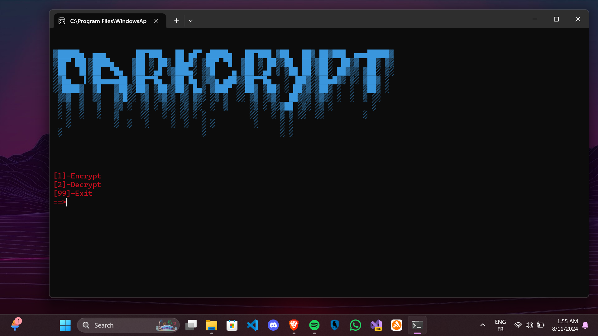

# DarkCrypt

DarkCrypt is a powerful Python-based tool designed for encrypting and decrypting files. Whether you need to secure a single file or process multiple files at once, DarkCrypt provides a simple and efficient solution.

## Features

- **Single File Encryption/Decryption:** Encrypt or decrypt individual files with ease.
- **Mass File Encryption/Decryption:** Batch process multiple files simultaneously.
- **User-Friendly Interface:** Intuitive command-line interface for seamless operation.

## Screenshot



## Installation

To install DarkCrypt, clone the repository and navigate to the directory:

```bash
git clone https://github.com/yourusername/DarkCrypt.git
cd DarkCrypt
pip install -r requirements.txt
python3 main.py 
